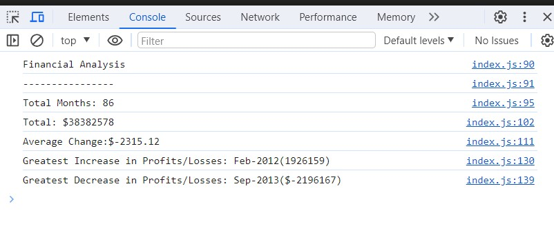

# Console-Finances

## Overview
this task is about creating code for analyzing the financial records of a company by  using JavaScript language with different methods such as if statement and for loop.

## Instructions

1. Creating a GitHub repo  `Console-Finances`. Then, clone it.
2. JavaScript code analyzes the records to calculate operations.

## Qestions
  [My Github profile](https://github.com/nill-10)
